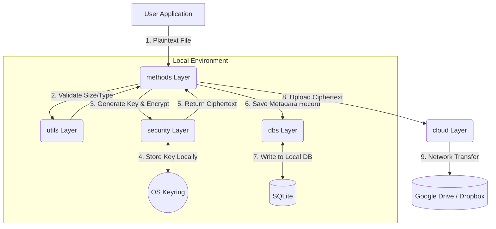

# Crypteria

Welcome to **Crypteria**, a powerful local-first encryption and secure cloud-storage management toolkit in Python. This package enables developers to seamlessly integrate end-to-end encryption into their applications before transparently uploading data to cloud providers like Google Drive and Dropbox.

## Overview

Crypteria is built on the premise that the cloud provider should **never** have access to your raw data or your cryptographic keys. All encryption happens locally on your machine, leveraging OS-native secure enclaves (via `keyring`) to handle sensitive credentials and encryption keys cleanly.

## Architecture & Data Flow

Below is the conceptual architecture and lifecycle of a file during an upload operation:



### Module Breakdown (Submodules)
To maintain strict separation of concerns, the SDK is segmented into specific functional layers:
- **[`cloud`](./cloud/README.md)**: cloud service adapters and external API handling.
- **[`dbs`](./dbs/README.md)**: Local metadata storage and relationship tracking using SQLite.
- **[`methods`](./methods/README.md)**: The central orchestrator bridging validations, encryption, persistence, and networks.
- **[`security`](./security/README.md)**: Cryptographic API, symmetric encryption, and safe `keyring` operations.
- **[`services`](./services/README.md)**: Background utilities, such as unified logging.
- **[`utils`](./utils/README.md)**: Pydantic schemas, file validations, and cross-platform path resolution.

## Installation

Install Crypteria via pip:

```bash
pip install crypteria
```

### Dependencies
Crypteria relies on a few robust, industry-standard packages:
- `cryptography`: For Fernet symmetric encryption.
- `keyring`: For OS-level secure credential management.
- `sqlalchemy`: For cross-platform metadata database handling.
- `pydantic`: For rigorous input validation.
- `google-api-python-client` / `google-auth-oauthlib`: For Google Drive interactions.
- `dropbox`: For Dropbox interactions.

## Quick Start Example

Here is a basic example of uploading a local private document to Dropbox securely.

```python
from crypteria.methods.upload import upload_document
from pathlib import Path

# Provide the absolute path to your file
my_file = Path("C:/Users/Documents/super_secret_financials.pdf")

# Crypteria handles Validation -> Encryption -> DB Metadata -> cloud Upload
file_id = upload_document(my_file, provider="Dropbox")

print(f"Successfully uploaded securely! File reference ID: {file_id}")
```

## Contributing & Reporting Issues

We welcome contributions! If you would like to help improve Crypteria:
1. Fork this repository.
2. Create a feature branch (`git checkout -b feature/amazing-feature`).
3. Commit your changes (`git commit -m 'Add amazing feature'`).
4. Push to the branch (`git push origin feature/amazing-feature`).
5. Open a Pull Request.

If you encounter any bugs, security concerns, or have feature requests, please [open an issue](https://github.com/your-username/crypteria/issues) on our GitHub repository.
